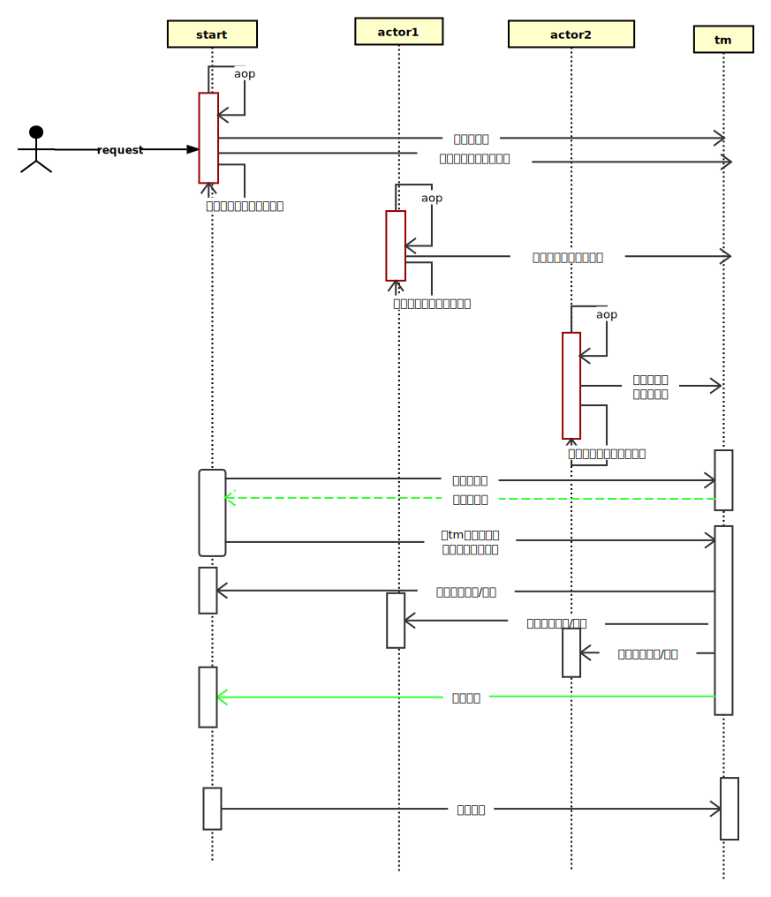
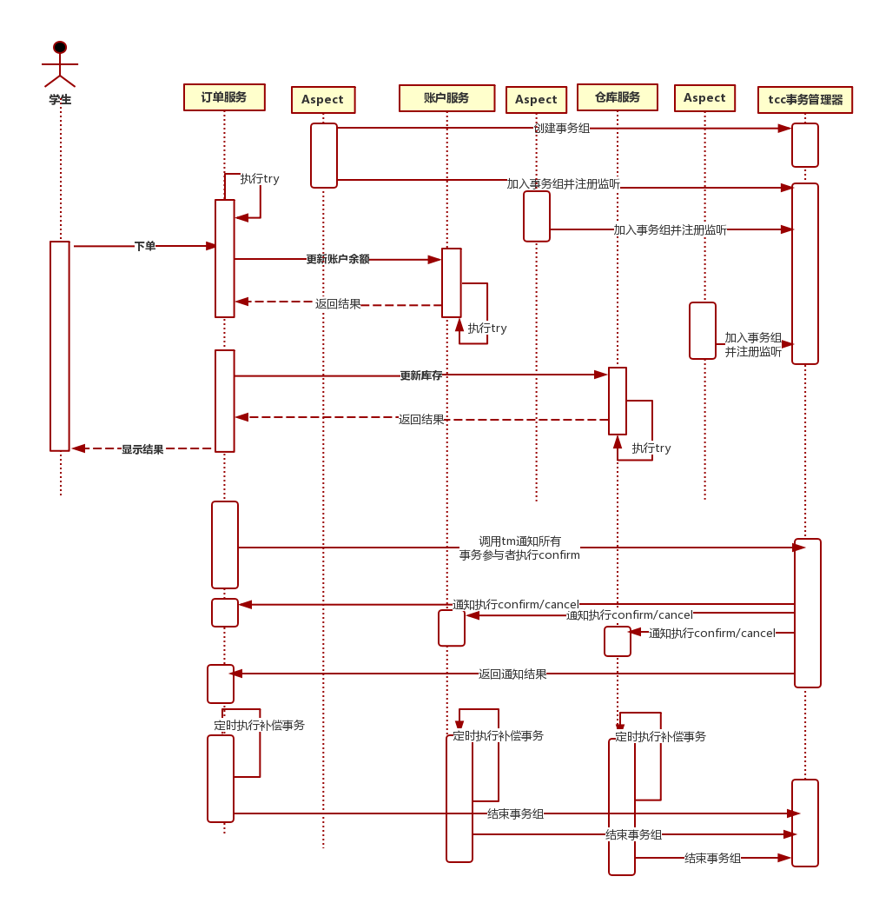

rains-transaction
================

rains-transaction是强一致性分布式事务，是基于二阶段提交+本地事务补偿机制来实现。

基于java语言来开发（JDK1.8），基于dubbo的RPC特性进行分布式事务。

 # Features

  * **框架特性**

      * 充分使用dubbo的rpc框架特性简化分布式事务的实现。

      * 事务发起者，参与者与协调者基于dubbo长连接与参数回调通信,稳定高效。

      * tm事务管理者基于dubbo的服务使用zk做注册中心，支持集群模式。

      * 采用Aspect AOP 切面思想与Spring无缝集成。

      * 配置简单，集成简单，源码简洁，稳定性高，已在生产环境使用。

      * 内置经典的分布式事务场景demo工程，并有swagger-ui可视化界面可以快速体验。


 * ***事务角色***

   * 事务发起者（可理解为消费者 如：dubbo的消费者）,发起分布式事务

   * 事务参与者（可理解为提供者 如：dubbo的提供者),参与事务发起者的事务

   * 事务管理者（tx-manager,dubbo服务），协调分布式事务的提交，回滚等。

 * ***技术方案***

   * 协调者（tx-manager）基于dubbo的服务，支持集群配置，达到服务的高可用，采用redis集群来分布式存储事务数据,发起者进行长连接通信。

   * 发起者与协调者，采用Aspect AOP 切面思想，SPI，多线程，异步回调，线程池，netty通信等技术。


 * ***SPI扩展***
     * 本地补偿事务恢复，支持redis，mogondb，zookeeper，file，mysql等关系型数据库
     * 本地事务序列化保存，支持java，hessian，kryo，protostuff
``
# Design
 ### [架构设计]
 *      分布式二段提交事务(已实现)
 
  *     tcc事务架构设计(待实现)
 

#   Configuration

  ###  [配置详解](https://github.com/hugoDD/rains-transaction/wiki/configuration%EF%BC%88%E9%85%8D%E7%BD%AE%E8%AF%A6%E8%A7%A3%EF%BC%89)


# Prerequisite

  *   #### JDK 1.8+

  *   #### Maven 3.2.x

  *   #### Git

  *   ####  RPC framework dubbo 。

# Quick Start

   * ### Clone & Build
      ```
      > git clone https://github.com/hugoDD/rains-transaction.git
   
      > cd rains-transaction
   
      > mvn -DskipTests clean install -U
      ```

  

# User Guide

###  [dubbo 用户](https://github.com/hugoDD/rains-transaction)


# FAQ

* ### 为什么我下载的代码后，用idea打开没有相应的get set 方法呢？
   ##### 答：因为框架使用了Lombok包，它是在编译的时期，自动生成get set方法，并不影响运行，如果觉得提示错误难受，请自行下载lombok包插件，[lombok官网](http://projectlombok.org/)


